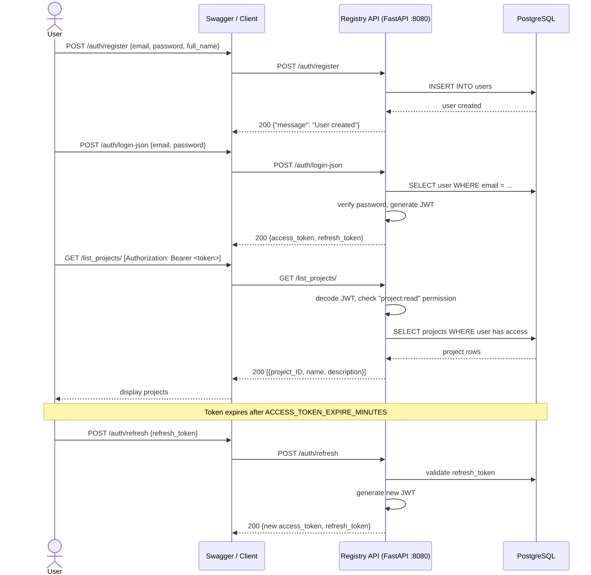

Auth Flow
=========

The authentication flow describes how a user registers, authenticates,
obtains JWT tokens, accesses protected endpoints, and refreshes an
access token.

The sequence includes the following main operations:

* User registration.
* User authentication.
* JWT access and refresh token generation.
* Requests to protected endpoints.
* Refreshing an access token.

Authentication Sequence
-----------------------

The following sequence diagram illustrates the authentication and
permissions flow of the Model Registry.

Flow Description
----------------

The sequence begins when the user registers an account through the API.
After registration, the user authenticates using the login endpoint.

The API verifies the credentials and generates an access token and a
refresh token.

The access token is then sent with protected requests. The API decodes
the JWT and checks the required permission before accessing the database.

When the access token expires, the refresh token can be exchanged for
a new access token.