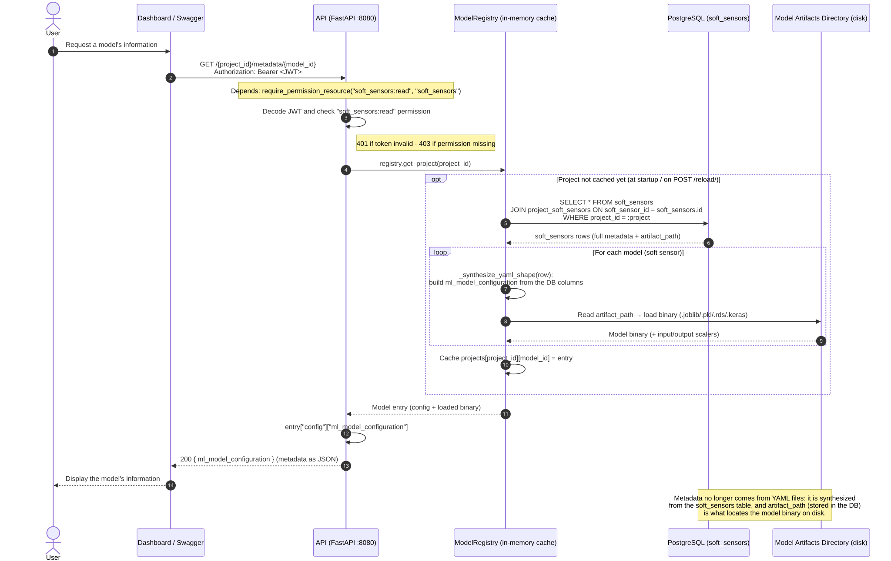

Model Retrieval Flow
====================

The Model Retrieval Flow describes how information about a registered
model is requested and returned through the STAMM Model Registry API.

The flow focuses on the interaction between the client, the API layer,
the Model Registry, and the PostgreSQL database.

Model Retrieval Sequence
------------------------

The following sequence diagram illustrates the model retrieval process.

Flow Description
----------------

The model retrieval flow is based on the project identifier and the
model identifier.

The API provides endpoints for listing the models registered in a
project and retrieving the configuration associated with a specific
model.

Examples include:

.. code-block:: text

   GET /{project_id}/list_soft_sensors/

   GET /{project_id}/metadata/{model_id}

The metadata endpoint returns the soft sensor's full configuration
as JSON.