Bioprocess & Runs
=================

Overview
--------

The **Bioprocess & Runs** domain groups the database entities related
to bioprocess projects, experiments, executions, equipment,
instruments, sensors, actuators, and simulations.

Entity-Relationship Diagram
---------------------------

The following diagram provides a focused view of the tables and
relationships associated with this domain.

Focused view: This diagram presents the entities associated with the Bioprocess & Runs domain. Some relationships with entities outside this domain may not be shown in this focused view.
