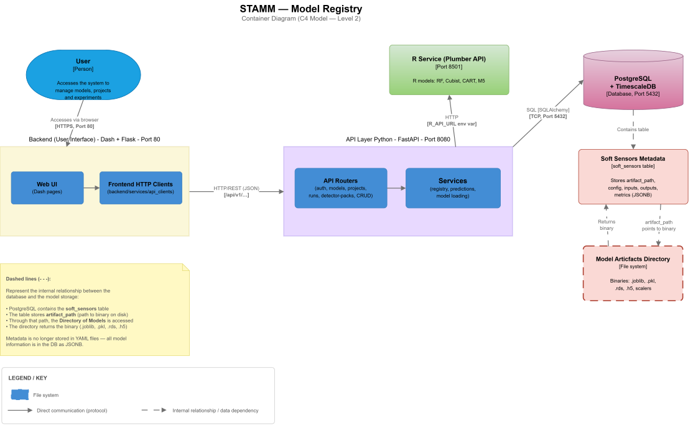

Architecture
============

The STAMM Model Registry architecture describes the main application
containers, their internal components, communication paths, and data
storage mechanisms.

This documentation uses a C4 Container Diagram (Level 2) to represent
the main runtime components of the Model Registry.

High-Level Architecture
-----------------------

The following diagram presents the current documented architecture of the
STAMM Model Registry.

Architecture Overview
---------------------

The architecture is organized into the following main containers and
supporting elements.

User
~~~~

The **User** represents the person interacting with the Model Registry
through the web interface.

The user accesses the dashboard over HTTPS through port ``80``.

Backend (User Interface)
~~~~~~~~~~~~~~~~~~~~~~~~

The **Backend (User Interface)** provides the web-facing dashboard and
contains the components used by users to interact with the system.

Web UI
^^^^^^

The **Web UI** contains the Dash pages presented to the user.

Frontend HTTP Clients
^^^^^^^^^^^^^^^^^^^^^

The **Frontend HTTP Clients** provide the client-side communication layer
used by the dashboard to call the Model Registry API.

The diagram identifies this communication as:

.. code-block:: text

   HTTP/REST (JSON)
   /api/v1/...

API Layer
~~~~~~~~~

The **API Layer** is implemented with FastAPI and is exposed through
port ``8080``.

It contains the API routers and the Model Registry core.

API Routers
^^^^^^^^^^^

The **API Routers** provide the REST endpoints used by the application.

The diagram identifies routers related to:

* Authentication
* Models
* Projects
* Runs
* Detector packs
* CRUD operations
* Other registry operations

Model Registry
^^^^^^^^^^^^^^

The **Model Registry** represents the core registry logic inside the
API layer.

The diagram identifies its implementation as:

.. code-block:: text

   core/registry.py

The registry is database-backed and uses SQLAlchemy to interact with
PostgreSQL.

PostgreSQL + TimescaleDB
~~~~~~~~~~~~~~~~~~~~~~~~

The database container provides PostgreSQL with TimescaleDB support.

It is exposed on port ``5432`` and stores the data used by the Model
Registry.

The architecture diagram shows the database as the main persistent
data store for the registry.

R Service
~~~~~~~~~

The **R Service** is implemented as a Plumber API and is exposed through
port ``8501``.

It provides support for R-based models including:

* Random Forest (RF)
* Cubist
* CART
* M5

The API layer communicates with the R Service through HTTP using the
``R_API_URL`` environment variable.

Model Artifacts
~~~~~~~~~~~~~~~

Model artifacts are stored in the **Model Artifacts Directory**, represented
as a file-system or volume-based storage component.

The diagram identifies examples of stored artifacts such as:

* ``.joblib`` files
* ``.pkl`` files
* ``.rds`` files
* ``.h5`` files
* Scalers

The Model Registry accesses these files using the artifact information
associated with the registered model.

Communication Paths
-------------------

The main communication paths represented in the architecture are:

.. list-table::
   :header-rows: 1
   :widths: 35 35 30

   * - Source
     - Destination
     - Communication
   * - User
     - Backend (User Interface)
     - HTTPS, port ``80``
   * - Web UI
     - Frontend HTTP Clients
     - Internal application interaction
   * - Frontend HTTP Clients
     - API Routers
     - HTTP/REST (JSON), ``/api/v1/...``
   * - API Routers
     - Model Registry
     - Internal application call
   * - Model Registry
     - PostgreSQL + TimescaleDB
     - SQL through SQLAlchemy
   * - API Layer
     - R Service
     - HTTP using ``R_API_URL``
   * - Model Registry
     - Model Artifacts Directory
     - File-system / volume access

Database and Model Metadata
---------------------------

The architecture identifies PostgreSQL + TimescaleDB as the persistent
database layer used by the Model Registry.

The diagram also identifies **Soft Sensors Metadata** as database-backed
information associated with the ``soft_sensors`` data.

The represented metadata includes:

* ``artifact_path``
* ``config``
* ``inputs``
* ``outputs``
* ``metrics``

These values are represented as JSONB data in the database.

Architecture Diagram Legend
---------------------------

The diagram uses visual conventions to distinguish different types of
components and relationships.

.. list-table::
   :header-rows: 1
   :widths: 30 70

   * - Visual element
     - Meaning
   * - Yellow components
     - User interface and dashboard-related components.
   * - Green components
     - API and application-layer components.
   * - Purple database
     - PostgreSQL + TimescaleDB data store.
   * - Orange storage component
     - Model artifacts stored on the file system or volume.
   * - Solid arrow
     - Normal application communication flow.
   * - Dashed arrow
     - Indirect relationship or a connection that requires confirmation.

Architecture Finding Requiring Confirmation
--------------------------------------------

The diagram identifies a direct database connection from three backend
services:

.. code-block:: text

   soft_sensors_service
   role_service
   project_soft_sensors_service

The diagram represents this connection as a direct SQLAlchemy session
that bypasses the API layer.

This connection is explicitly marked:

.. note::

   **TO CONFIRM with Camilo.**

It should therefore be treated as an identified finding rather than a
confirmed architectural rule.

Ports and Endpoints
-------------------

The main ports represented in the architecture are:

.. list-table::
   :header-rows: 1
   :widths: 35 20 45

   * - Component
     - Port
     - Purpose
   * - Backend (User Interface)
     - ``80``
     - User-facing dashboard.
   * - PostgreSQL + TimescaleDB
     - ``5432``
     - Database service.
   * - API Layer
     - ``8080``
     - FastAPI REST API.
   * - R Service
     - ``8501``
     - Plumber API for R-based models.

Architecture Status
-------------------

This page documents the architecture represented by the current
C4 Container Diagram.

Connections explicitly marked as requiring confirmation should not be
interpreted as finalized architectural decisions until they have been
verified against the implementation.